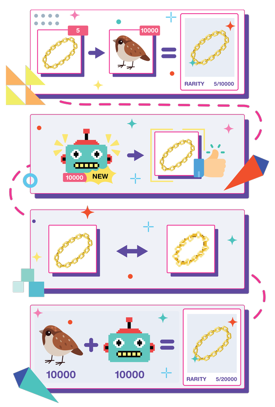

Because all RMRK [nestable](/lego1-nested) and [equippable](/lego25-equippable) NFTs are mutually
compatible and can leverage [multi assets](/lego2-multi-resource) to use different media and
art styles for this cross-collection compatibility, the concept of a _Global Item Economy_
(GIE) appears.

This also creates another concept: NFT DEGEN Score (Demand for Globally Equippable NFTs), or in
other words, dynamic rarity.

Traditionally in other ecosystems, if you have a collection of 10000 Sparrows and 5 of them have a
gold chain, then the rarity of the gold-chained Sparrow is 5/10000.

In RMRK, not only is this gold chain [equippable](/lego25-equippable) onto all other Sparrows, but
someone else can later launch a totally unrelated collection of Robots who are made compatible with
this gold chain.

The gold chain NFTs would be given a [new asset](/lego2-multi-resource) which visually matches
the style of the robot project, and become equippable by the 10000 Robots.

Now, the rarity of the gold chain is no longer 5 / 10000, but 5 / 20000.

Therefore, the demand for this NFT went up, because it is now usable in twice as many other NFTs.

This does not have to stop at visual accessories. As noted in [equippables](/lego25-equippable):

> A song NFT could have as an asset a music base with a fixed beat, but slots for vocals, drums,
> synth, effect, even a slot for a visualization - perhaps even for some runnable
> [p5.js](https://p5js.org/) code.

> Not only is this really cool in the context of paying royalties to anyone who contributed to a
> song's creation with their own stem, but we can take it further: the song itself, or maybe just a
> single stem can be made equippable on the catalog asset of a metaverse land.

> That way, whoever enters this land gets it played as a soundtrack of the area, background music.
> The music is thus compatible not just with its own project, or the issuer's associated projects,
> but with any project that can be launched on RMRK standards.

The DEGEN score of the music tracks goes up by a lot, purely because they have been made compatible
with tens of thousands of virtual real estate plots.
